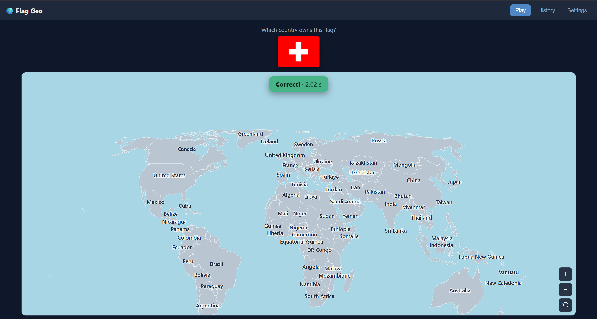
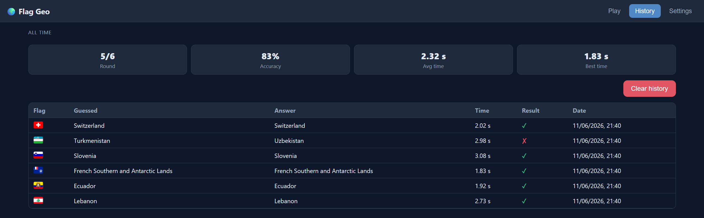
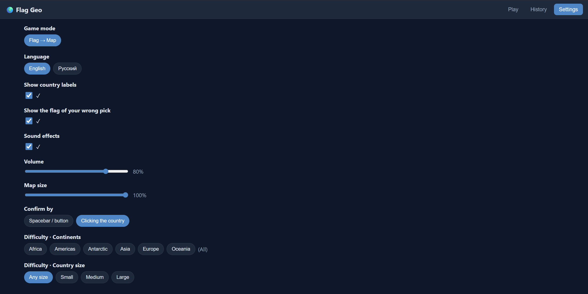

# Flag Geo — Guess the Country

A fully offline flag-and-geography quiz. You're shown a country's flag and have
to find that country on a world map. Runs in the browser (Vite + React) or as a
native desktop/mobile app (Tauri 2). Everything — the map, the flag SVGs and the
country names — is bundled at build time, so there are **no runtime network
requests**.

## Gameplay

- A flag is shown; click the matching country on the interactive world map.
- Rounds are timed, and your accuracy and best/average times are tracked per
  session.
- Every round is logged to a persistent **History** screen.
- Indistinguishable flags are treated fairly: guessing Chad when shown Romania
  (or Indonesia/Monaco) counts as correct — see `src/game/flagTwins.ts`.

### Difficulty & options

Configured on the **Settings** screen and persisted to `localStorage`:

- **Continents** — restrict the pool to one or more regions.
- **Country size** — small (`< 50,000 km²`), medium, or large (`> 1,000,000 km²`).
- **Confirm mode** — click-to-confirm, or select then press space.
- **Map size**, country labels, sound on/off, volume.
- **Language** — English or Russian (`ru` is the default).

## Tech stack

- **React 18** + **Zustand** for state (separate stores for game loop, settings,
  history, UI).
- **d3-geo** + **topojson-client** for the map projection and rendering, using
  the `world-atlas` 110m TopoJSON.
- **flag-icons** for flag SVGs; **world-countries** for ISO codes, areas,
  regions and localized names.
- **Vite** for the web build, **Tauri 2** for native packaging.
- **TypeScript** throughout.

## Preview





## Project layout

```
scripts/gen-data.mjs   Build-time data generation (run once, see below)
src/
  components/          Map, flag, prompt, controls, stats, feedback
  screens/            Game, History, Settings
  store/              Zustand stores (game, settings, history, ui)
  game/               Mode registry, country pool, flag twins, sound, stats
  data/               Generated country metadata + loader
  i18n/               Localized country names + UI strings (en, ru)
  map/                World TopoJSON loading
  assets/             Bundled countries-110m.json
src-tauri/            Tauri (Rust) shell, config, icons, capabilities
```

The game loop (`src/store/gameStore.ts`) is renderer- and mode-agnostic. New game
modes are added by registering an entry in `src/game/modes.ts` and a prompt
renderer — no changes to scoring, persistence, or the map.

## Getting started

Requires Node.js. For native builds you also need the
[Rust toolchain](https://www.rust-lang.org/tools/install) and the
[Tauri prerequisites](https://tauri.app/start/prerequisites/) for your platform.

```sh
npm install
npm run gen-data   # generate bundled country/map/locale data (one-time, or after dep bumps)
npm run dev        # start the Vite dev server (http://localhost:5173)
```

### Scripts

| Command             | Description                                                                |
| ------------------- | -------------------------------------------------------------------------- |
| `npm run gen-data`  | Regenerate bundled data into `src/data`, `src/i18n/locales`, `src/assets`. |
| `npm run dev`       | Vite dev server with hot reload.                                           |
| `npm run build`     | Type-check and produce a production web build in `dist/`.                  |
| `npm run preview`   | Serve the production build locally.                                        |
| `npm run typecheck` | Type-check without emitting.                                               |
| `npm run tauri`     | Tauri CLI passthrough (e.g. `npm run tauri dev`, `npm run tauri build`).   |

### Native app

```sh
npm run tauri dev     # run the desktop app against the dev server
npm run tauri build   # build a native bundle (installers, see src-tauri/tauri.conf.json)
```

## Data generation

`npm run gen-data` is the only step that touches the network's worth of data, and
it does so at build time from local npm packages. It produces, all checked into
the repo so the app is self-contained:

- `src/assets/countries-110m.json` — world map TopoJSON (from `world-atlas`).
- `src/data/countries.json` — per-country metadata (ISO codes, area, region).
- `src/i18n/locales/{en,ru}.json` — country names keyed by numeric ISO code.

Keys are normalized numeric ISO 3166-1 codes (no leading zeros) so the metadata,
locale names, and map ids always line up. To add a language, emit another locale
file in `gen-data.mjs` and register it in `src/i18n/index.ts`.
